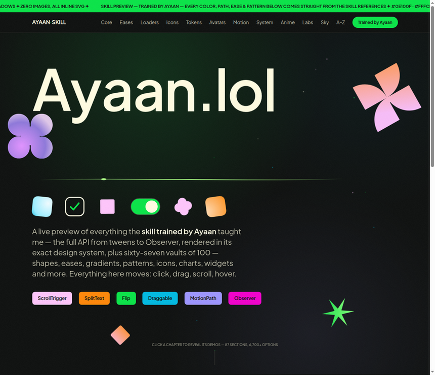

<div align="center">

# ayaan.lol

### A living showcase for a website design skill for Claude

<p>
  <a href="https://ayaan.lol"><strong>Open the live showcase</strong></a>
  ·
  <a href="https://github.com/ayaanoncrypto/WebsiteDesignSkillForclaude/issues">Report an issue</a>
</p>


<p>
  
</p>

</div>

## Overview

ayaan.lol is a live, interactive reference for building expressive web interfaces with Claude. It presents animation patterns, design tokens, components, visual systems, and complete interface sections in one navigable experience.

The showcase focuses on interaction quality. Click, drag, hover, scroll, and switch between visual systems to inspect how each pattern behaves.

> The repository currently acts as the public project landing page and visual preview. The full showcase runs at [ayaan.lol](https://ayaan.lol).

## What you will find

| Area | Coverage |
| --- | --- |
| Animation | Tweens, timelines, easing, stagger, ScrollTrigger, SplitText, Draggable, Flip, MotionPath, Observer, and morphing |
| Identity | Design tokens, logo systems, wordmarks, color, type, and spacing |
| Components | Buttons, inputs, cards, charts, toasts, tables, dialogs, players, and app-shell patterns |
| Assets | Shapes, icons, badges, avatars, shadows, chain icons, token icons, and project logos |
| Anime systems | Manga effects, kotatsu bubbles, weather, RPG windows, mecha HUDs, kawaii controls, and a gacha theater |
| Landing systems | Niche landing kits, trend aesthetics, structural patterns, and complete hero sections |
| Sky systems | Pure CSS animated skies and an interactive weather station |
| A to Z library | Alerts, authentication, KPIs, loaders, modals, notifications, onboarding, pricing, search, users, video, wizards, and more |

The live page contains 11 chapters, 87 sections, and more than 6,700 selectable options. Each vault holds 100 options, and many examples expose copyable snippets.

## Highlights

- A working gacha theater with rarity states, screen flash, rings, sparkles, and a pity counter.
- A weather station with city selection, crossfaded skies, and animated temperature values.
- Ten visual systems, including minimal, bento, glass, clay, vaporwave, Y2K, cyberpunk, and pixel styles.
- Drag interactions with inertia, snapping, split panes, and resizable stages.
- A command palette pattern for app-shell navigation.
- A reduced-motion path for users who prefer less animation.

## Quick start

This repository does not require a build step.

```bash
git clone https://github.com/ayaanoncrypto/WebsiteDesignSkillForclaude.git
cd WebsiteDesignSkillForclaude
```

Open the project preview in your browser:

```text
https://ayaan.lol
```

If you downloaded the full showcase archive, open its `index.html` file directly. The live project uses inline SVG, CSS motion, and a local motion engine, so it works without a package install or application server.

## Repository layout

```text
.
├── README.md       Project overview and developer guide
├── preview.png     README hero preview
└── .github/
    └── ISSUE_TEMPLATE/
        └── site-issue.yml
```

The repository intentionally keeps the public landing page lightweight. The live implementation remains at [ayaan.lol](https://ayaan.lol).

## Design system

The project uses a fixed house palette:

| Token | Value | Use |
| --- | --- | --- |
| Near black | `#0e100f` | Base surfaces and background |
| Cream | `#fffce1` | Primary text and contrast |
| Electric green | `#0ae448` | Active states and highlights |
| Pink | `#fec5fb` | Accent surfaces |
| Orange | `#ff8709` | Warm interactive states |
| Blue | `#00bae2` | Informational accents |

The page pairs PP Mori with Plus Jakarta Sans. It uses inline SVG and CSS for ornaments, diagrams, scenes, and motion details.

## Working with the preview

The `preview.png` file shows the current live hero state. Update it when the first viewport changes.

```bash
# Replace preview.png with a fresh screenshot of the live hero.
# Keep the final file readable in GitHub's README renderer.
```

Keep preview changes focused. A preview should show the product, not the browser chrome or debugging overlays.

## Contributing

Small documentation fixes and preview improvements are welcome. Before opening an issue or pull request:

1. Check the live page at [ayaan.lol](https://ayaan.lol).
2. Search existing [issues](https://github.com/ayaanoncrypto/WebsiteDesignSkillForclaude/issues).
3. Describe the visible behavior, expected behavior, and reproduction steps.
4. Keep visual changes aligned with the existing palette, typography, and motion direction.
5. Include a before and after image for visual changes.

Use the repository issue form for site problems. See [CONTRIBUTING.md](CONTRIBUTING.md) for the full contribution checklist.

<div align="center">

## The 100-star goal

> ### If this repo reaches **100 stars**, I publish the **skill file**.
> The trained skill generated every pixel of this page:
> 22 catalogs · 18 generators · ~7,000 options · ready to drop into Claude.

**Star · Watch · Share**

</div>

## Credits

Created by [Ayaan](https://www.onchainbio.click/ayaan).

- Live project: [ayaan.lol](https://ayaan.lol)
- Repository: [WebsiteDesignSkillForclaude](https://github.com/ayaanoncrypto/WebsiteDesignSkillForclaude)
- Preview asset: `preview.png`

## License

No license has been published yet. Until a license appears in this repository, treat the source and assets as all rights reserved.
